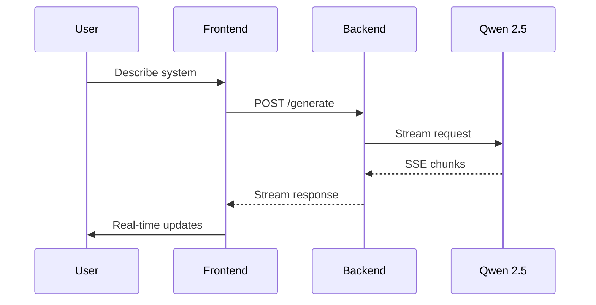

# 🚀 PrepedAI - AI-Powered System Design Tool

An intelligent system design assistant that transforms natural language descriptions into comprehensive architecture blueprints, database schemas, and API specifications.


## ✨ Features

- 🧠 **AI-Powered Design** - Generate system architectures from plain English
- 📡 **Real-Time Streaming** - SSE-based streaming for instant feedback
- 🏗️ **Architecture Diagrams** - Auto-generated Mermaid flowcharts
- 🗄️ **Database Schemas** - ERD diagrams with relationships
- 🔌 **API Specifications** - RESTful endpoint documentation
- 📋 **Blueprint Generation** - Step-by-step implementation plans
- 🎨 **Glassmorphism UI** - Modern, premium design aesthetic

## 🛠️ Tech Stack

| Layer | Technology |
|-------|------------|
| **Frontend** | Next.js 15, React 18, Tailwind CSS |
| **Backend** | Express.js |
| **State** | Zustand |
| **AI** | Qwen 2.5 (via LM Studio) |
| **Diagrams** | Mermaid.js |
| **Monorepo** | Turborepo |
| **Package Manager** | Bun |

## 📦 Project Structure

```
prepedai/
├── apps/
│   ├── web/          # Next.js frontend
│   └── api/          # Hono.js backend
├── packages/
│   ├── ui/           # Shared UI components
│   ├── eslint-config/
│   └── typescript-config/
└── turbo.json
```

## 🚀 Getting Started

### Prerequisites

- [Bun](https://bun.sh/) (v1.0+)
- [LM Studio](https://lmstudio.ai/) with Qwen 2.5 model running locally

### Installation

```bash
# Clone the repository
git clone https://github.com/yourusername/prepedai.git
cd prepedai

# Install dependencies
bun install
```

### Environment Setup

Create `.env` files in the respective app directories:

**apps/api/.env**
```env
LLM_API_URL=http://localhost:1234/v1  # LM Studio endpoint
```

### Running the App

```bash
# Start both frontend and backend
bun run dev

# Or run individually
bun run dev --filter=web    # Frontend on http://localhost:3000
bun run dev --filter=api    # Backend on http://localhost:3001
```

## 🔄 How It Works



1. **Intent Input** - User describes what they want to build
2. **Clarification** - AI asks targeted questions to understand requirements
3. **Architecture** - Generates system component diagrams
4. **Database** - Creates ERD with tables and relationships
5. **API Design** - Documents endpoints with request/response schemas
6. **Blueprint** - Produces step-by-step implementation plan

## 📡 SSE Streaming

Real-time streaming using Server-Sent Events for responsive UX:

```typescript
// Backend streams chunks
const stream = new ReadableStream({
  async start(controller) {
    for await (const chunk of llmResponse) {
      controller.enqueue(`data: ${JSON.stringify({ content: chunk })}\n\n`);
    }
  }
});

// Frontend consumes
const eventSource = new EventSource('/api/stream');
eventSource.onmessage = (e) => updateUI(JSON.parse(e.data));
```

## 🎨 UI Design

- **Glassmorphism** - Frosted glass effects with `backdrop-blur-xl`
- **Dark/Light Mode** - Full theme support
- **Progressive Disclosure** - Tabbed interface reveals content as generated
- **Micro-animations** - Smooth transitions and loading states

## 🔮 Future Improvements

- [ ] Persistent storage with database
- [ ] User authentication
- [ ] Multiple LLM provider support (Gemini, OpenAI, Claude)
- [ ] Export to PDF/image
- [ ] Collaborative editing
- [ ] Rate limiting
- [ ] WebSocket for bi-directional communication

## 📝 Scripts

```bash
bun run dev       # Start development servers
bun run build     # Build all packages
bun run lint      # Run ESLint
bun run type-check # TypeScript validation
```

## 🤝 Contributing

Contributions are welcome! Please feel free to submit a Pull Request.

## 📄 License

MIT License - feel free to use this project for learning and development.

---

Built with ❤️ using Next.js, Express, and Qwen 2.5
